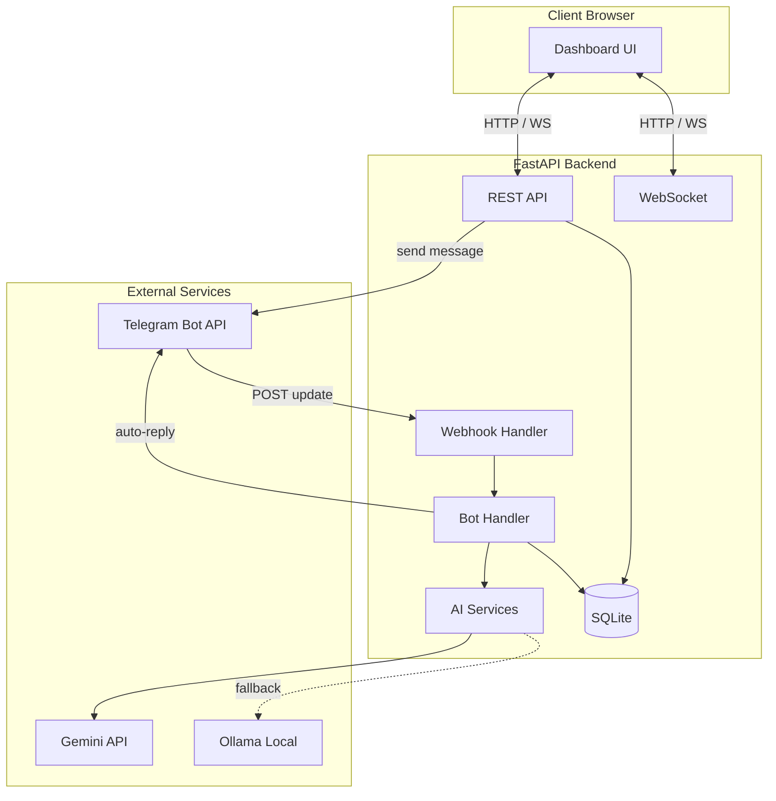
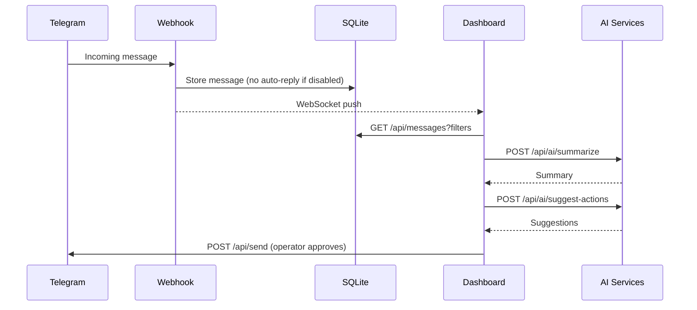
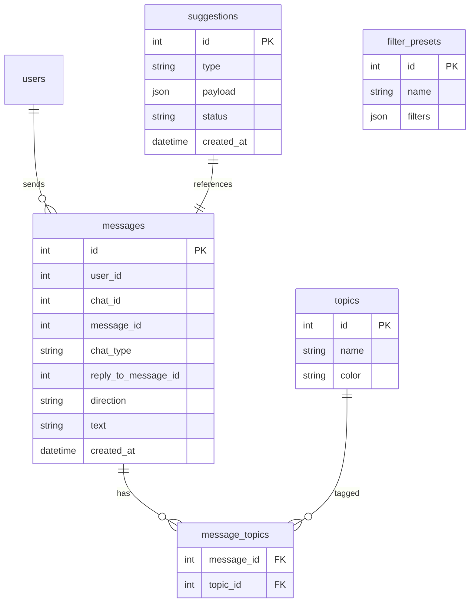

# Architecture

## System overview



---

## Current architecture (Sprint 0)

### Layers

| Layer | Responsibility | Key files |
|-------|----------------|-----------|
| **Presentation** | Dashboard UI, theme, charts | `frontend/` |
| **API** | REST, WebSocket, auth | `backend/routes/api.py` |
| **Ingestion** | Telegram webhook processing | `backend/routes/webhook.py`, `bot_handler.py` |
| **Services** | Telegram API, AI providers | `backend/services/` |
| **Data** | SQLite persistence | `backend/models/store.py` |

### Message flow (current)

1. Telegram sends update → `POST /webhook/telegram`
2. `bot_handler` extracts user, text, chat
3. Message stored in `messages` table
4. `ai_service` generates reply (Gemini → Ollama → built-in)
5. Reply sent via Telegram API and stored as outgoing message
6. WebSocket broadcasts update to dashboard

### AI architecture (current)

```
ai_service
├── GeminiProvider (primary)
├── OllamaProvider (fallback)
└── _fallback_response (built-in commands)
```

AI tools available to the **bot** (not yet the operator dashboard):

- `get_metrics`
- `analyze_command_usage`
- `webhook_notify`

---

## Target architecture (v0.3+)

### New components (planned)

| Component | Sprint | Purpose |
|-----------|--------|---------|
| `MessageQueryService` | 1 | Filtered/paginated message queries |
| `RedactionService` | 2 | Mask sensitive data before AI (D-05) |
| `SummarizationService` | 2 | English summaries + originals (D-04) |
| `ActionSuggestionService` | 2 | Reply drafts and next actions |
| `TopicService` | 3 | User-type + AI-assign modes (D-03) |
| `ReplyModeService` | 3 | Auto / manual / per-chat modes (D-01) |
| `OperatorSettings` | 3 | Presets, preferences |

### Target message flow (operator mode)



### Target data model additions



---

## Technology stack

| Layer | Technology |
|-------|------------|
| Backend | Python 3, FastAPI, httpx, SQLite |
| Frontend | HTML, CSS, vanilla JS (ES modules), Chart.js |
| AI primary | Google Gemini API |
| AI fallback | Ollama (OpenAI-compatible local API) |
| Real-time | WebSocket |
| Telegram | Bot API via webhook + sendMessage |

---

## Security considerations

| Area | Current | Target (v1.0) |
|------|---------|---------------|
| API auth | Static `X-API-Key` header | Session or JWT login |
| Webhook auth | `X-Telegram-Bot-Api-Secret-Token` | Unchanged |
| Secrets | `.env` file | `.env` + not exposed to frontend |
| Message data | Local SQLite | Local SQLite; backup documented |
