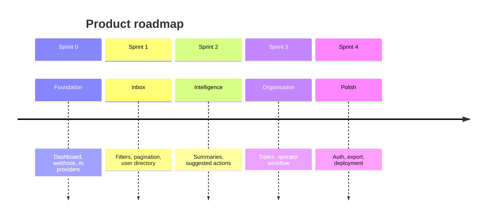

# Product Vision

## Product name

**Telegram Operator Dashboard**

## Elevator pitch

A web dashboard that lets the client review all recent Telegram bot conversations, filter messages by person and content, and use AI to generate summaries plus suggested replies and next actions — so they can manage conversations efficiently instead of reading every message manually.

## Problem statement

The client receives Telegram messages from multiple users but has no structured way to:

- Browse and filter conversations at scale
- Understand what needs attention without reading every message
- Get AI-assisted reply drafts and follow-up recommendations

The current bot auto-replies to every message, which does not support an **operator review-then-act** workflow.

## Product goals

1. **Visibility** — See all recent messages in one place with real-time updates
2. **Control** — Filter by sender, content, date, and (later) topic
3. **Intelligence** — Generate summaries of selected message sets
4. **Action** — Suggest replies and next steps; send with one click after review

## Target user

| Persona | Needs |
|---------|-------|
| **Operator (Client)** | Review inbox, filter messages, summarise threads, approve and send replies |

## Success metrics

| Metric | Target |
|--------|--------|
| Time to find a specific user's messages | < 10 seconds with filters |
| Time to generate a summary of a filtered set | < 15 seconds (Gemini) |
| Operator can send a suggested reply without leaving dashboard | Yes |
| Message loss on webhook ingest | 0% |

## Out of scope (v1)

- Multi-tenant / multi-bot support
- Native mobile app
- Full CRM integration
- Automated sending without operator approval (unless explicitly enabled later)

## Vision roadmap (high level)

