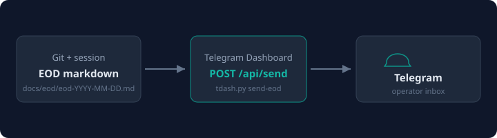

# Telegram Dashboard


Use this skill for **operator inbox** work (messages, threads, AI summarize/suggest, send replies) and **dev notify** work (EOD summaries, audit notes, feature-tracking alerts) through the running Telegram Dashboard.



## Configuration

Set environment variables in `openclaw.json` (`skills.entries.telegram-dashboard`) or copy `{baseDir}/.env.example` → `{baseDir}/.env`:

| Variable | Example | Purpose |
|----------|---------|---------|
| `TELEGRAM_DASHBOARD_URL` | `http://localhost:8000` | Dashboard base URL |
| `DASHBOARD_API_KEY` | `your-secret-key` | API authentication |
| `EOD_TELEGRAM_CHAT_ID` | `123456789` | Default recipient for `send-eod` |
| `NOTIFY_TELEGRAM_CHAT_ID` | `123456789` | Default recipient for `send-file` |

`tdash.py` loads `{baseDir}/.env` automatically (process env wins). Docker on the same compose network: `http://telegram-dashboard:8000`.

## Canonical CLI — `tdash.py`

Stdlib only (`urllib`). Always prefer this over raw curl.

### Operator inbox

```bash
python3 {baseDir}/scripts/tdash.py manifest
python3 {baseDir}/scripts/tdash.py metrics
python3 {baseDir}/scripts/tdash.py messages --q billing --limit 20
python3 {baseDir}/scripts/tdash.py threads --chat-type group
python3 {baseDir}/scripts/tdash.py summarize --summary-type brief --topics billing
python3 {baseDir}/scripts/tdash.py suggest --user-ids 101
python3 {baseDir}/scripts/tdash.py send --chat-id 1001 --text "Thanks, we will follow up."
python3 {baseDir}/scripts/tdash.py reply-mode
```

### Dev notify / EOD

```bash
python3 {baseDir}/scripts/tdash.py send-file --file reports/audit-2026-07-22.md
python3 {baseDir}/scripts/tdash.py send-file --file note.md --chat-id 1001
python3 {baseDir}/scripts/tdash.py send-eod --file docs/eod/eod-2026-07-22.md
```

- `send-file` — any text/markdown file; optional `--chat-id` (else `NOTIFY_TELEGRAM_CHAT_ID`).
- `send-eod` — EOD markdown; uses `EOD_TELEGRAM_CHAT_ID` from env / skill `.env`.
- Long files truncate at ~4096 chars with a footer note; full file stays on disk.

## Assets

| File | Use |
|------|-----|
| [assets/brand-mark.svg](assets/brand-mark.svg) | Skill / docs header |
| [assets/flow-eod-to-telegram.svg](assets/flow-eod-to-telegram.svg) | EOD pipeline diagram |
| [assets/icon-dev-notify.svg](assets/icon-dev-notify.svg) | Dev notify workflows |

## Operator workflows

1. **Check inbox** — `messages` or `threads`
2. **Summarize** — `summarize` with the same filters the operator would use
3. **Draft replies** — `suggest`, review, then `send`
4. **Workflow check** — `reply-mode` for auto-reply mode and per-chat relationship context

## Dev notify workflows

1. **EOD summary** — use Cursor skill `end-of-day-summary` (staged under `Telegram_dashboard/dev-skills/`) to write `docs/eod/eod-YYYY-MM-DD.md`, then `tdash.py send-eod --file …`
2. **General alerts / audit notes** — write markdown, then `send-file` or Cursor skill `telegram-dev-notify`
3. **Scheduled weekday EOD** — see draft `Telegram_dashboard/dev-skills/automations/hat-eod-telegram-addon.draft.json` (development tooling only; not public website content)

Install personal skills:

```bash
cp -r Telegram_dashboard/dev-skills/telegram-dev-notify ~/.cursor/skills/
cp -r Telegram_dashboard/dev-skills/end-of-day-summary ~/.cursor/skills/
```

## Direct API

```
X-API-Key: $DASHBOARD_API_KEY
POST $TELEGRAM_DASHBOARD_URL/api/send
{"chat_id": "...", "text": "..."}
```

Discovery: `GET /api/agent/manifest` · OpenAPI: `GET /openapi.json`

## Safety

- Do not send without explicit user approval unless they asked you to send.
- Summaries may use redacted data — originals stay in the database.
- Read `reply-mode` before drafting operator replies.
- EOD/automation sends are for **development audit trails**, not end-user-facing website content.
