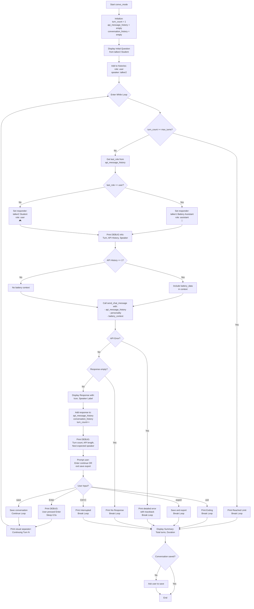

# Battery Monitor Conversation Flow

## Visual Flow Diagram



## Key Points

### Alternating Logic
The conversation alternates based on the **last role** in `api_message_history`:
- If last role is `"user"` → talker1 (assistant) responds
- If last role is `"assistant"` → talker2 (user) responds

### Turn Sequence
```
Turn 1: 🎮 talker2 asks (user)
  ↓ [User presses Enter]
Turn 2: 🔋 talker1 responds (assistant)
  ↓ [User presses Enter]
Turn 3: 🎮 talker2 follows up (user)
  ↓ [User presses Enter]
Turn 4: 🔋 talker1 responds (assistant)
  ↓ [Continues...]
```

### API Message History Structure
After Turn 3, the `api_message_history` looks like:
```python
[
    {"role": "user", "content": "Initial question from talker2"},      # Turn 1
    {"role": "assistant", "content": "Response from talker1"},         # Turn 2
    {"role": "user", "content": "Follow-up from talker2"}             # Turn 3
]
```

### Personality Injection
Each call to `send_chat_message()` includes:
1. **System message**: Either `talker1_personality` or `talker2_personality`
2. **Message history**: Full conversation up to this point
3. **Battery context**: Only included in Turn 2 (first assistant response)

### Why It Should Work Now

The debug output now clearly shows:
1. **Before each turn**: Who is about to speak and why
2. **After each turn**: What was added and who should speak next
3. **On errors**: Detailed information about what went wrong and when
4. **User actions**: Confirmation of what the user typed

This visibility makes it easy to:
- Verify the alternating pattern is correct
- Identify if/when the loop breaks unexpectedly
- See if Ollama is failing for a specific speaker
- Confirm the conversation continues past Turn 2
